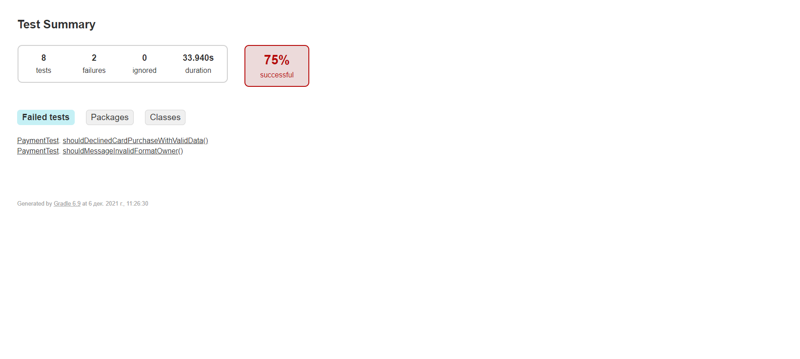
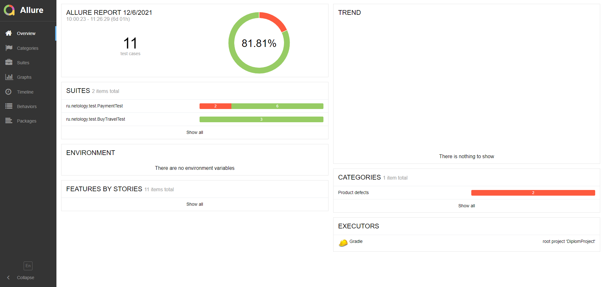

### Отчётные документы по итогам тестирования

**Краткое описание:**

Осуществлена работа над тестированием веб-сервиса по покупке тура для путешествия банковской картой и в кредит.
Написаны позитивные и негативные сценарии для автоматизированного тестирования исследуемого приложения.

**Количество тест-кейсов:**

Общее количество тест-кейсов - 11 шт (2 - позитивных, 9 - негативных):
- 3 авто-тестов для проверки базы данных MySQL;
- 8 авто-тестов для проверки пользовательского интерфейса (UI - тесты).

Отчет тестирования Gradle репорт:

Отчет тестирования Allure репорт:

В результате тестирования обнаружены дефекты, баг-репорты на которые оформлемы в разделе
рабочего репозитория [Issues](https://github.com/arsi8012/DiplomProject/issues)

**Общие рекомендации:**

Исправить все указанные выше дефекты в ближайшем обновлении веб-сервиса для корректного функционирования приложения.